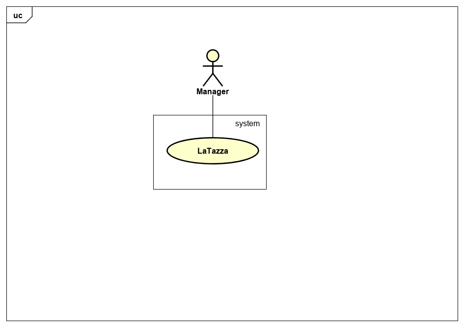
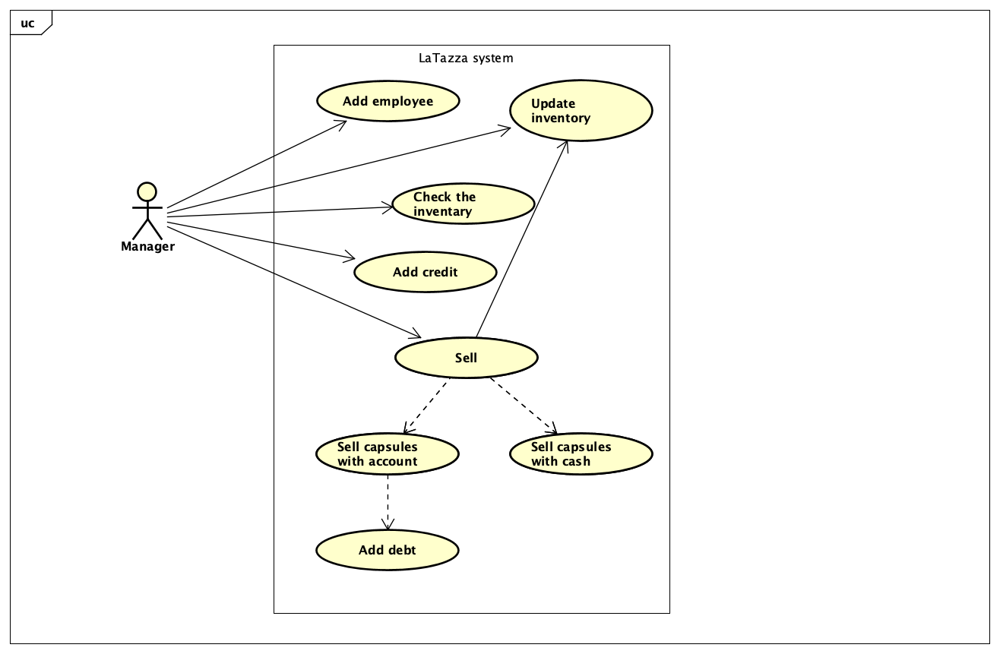

# Requirements Document Template

Authors: 
- Borgone Roberto (267571)
- Cetera Clemente (257234)
- Cefalo Domenico (267569)
- Miro Filomeno Davide (256870)

Date:
- 10/04/2019

Version:
- 2.0.0

# Contents

- [Stakeholders](#stakeholders)
- [Context Diagram and interfaces](#context-diagram-and-interfaces)
	+ [Context Diagram](#context-diagram)
	+ [Interfaces](#interfaces) 
	
- [Stories and personas](#stories-and-personas)
- [Functional and non functional requirements](#functional-and-non-functional-requirements)
	+ [Functional Requirements](#functional-requirements)
	+ [Non functional requirements](#non-functional-requirements)
- [Use case diagram and use cases](#use-case-diagram-and-use-cases)
	+ [Use case diagram](#use-case-diagram)
	+ [Use cases](#use-cases)
	+ [Relevant scenarios](#relevant-scenarios)
- [Glossary](#glossary)
- [System design](#system-design)

# Stakeholders


| Stakeholder name  | Description | 
| ----------------- |:-----------:|
|Manager | use LaTazza to manage purchases and payments of capsules |
|   Retailer  |  receive orders and perform delivery    |
|Employee| buy capsules through local account or by paying cash |
|Visitor| buy capsules by paying cash|
|Developper| create and implement functions for LaTazza|
|System manager| perform the operation and maintenance of LaTazza|
|Inventory| store and update the quantity of each type of capsule after a sale or an order | 

# Context Diagram and interfaces

## Context Diagram


## Interfaces
| Actor | Logical Interface | Physical Interface  |
| ------------- |:-------------:| -----:|
| Manager  | GUI (Graphical User Interface) | Screen/keyboard |

# Stories and personas

### Persona 1

##### Profile

> - male
> - middle age
> - professional
> - middle income
> - married with children

##### Life scenarios

> **Work day**
> 1. wake up
> 2. drive to office
> 3. check emails
> 4. breakfast at office
> 5. start work
> 6. lunch
> 7. resume work
> 8. daily work recap
> 9. drive to home
> 10. play with children
> 11. dinner
> 12. relax
> 13. go to sleep

> **Week end day**
> 1. wake up
> 2. breakfast
> 3. relax
> 4. lunch
> 5. play with children
> 6. drive to gym
> 7. work out
> 8. drive to home
> 9. dinner
> 10. watch tv
> 11. go to sleep

##### Story

###### Attilio Drago
---------------------------
###### *46, assurance company employee, husband and father of a child*

Attilio is a reliable person, so he was selected by his office colleagues for managing the money box dedicated to the supplying and distribution of capsules in the workplace. His company has an agreement with a capsules supplier, it is an Attilio's duty to weekly contact by phone this supplier for making sure everyone in the office can have a pleasant break at any time. The costs of the capsules supplying are shared among the employees by consumption, so Attilio accounts the capsules consumed by each employee on a paper to ensure fairness in defining each contribution.

**Goals**   
- Accounting on paper is a waste and there is the possibility to lost the notes. **A secure, easily consultable and updatable database could be useful to efficiently account employees debits and credits, along with the supply of new capsules.**

**Interaction examples**

Friday morning.
Attilio is in front of his computer at the office, checking emails. In the meanwhile of this routine action Attilio decides that the quantity of capsules in the inventory is not sufficent because of the higher number of work meetings fixed for the next week.
So Attilio places a new order to the supplier contacting him by phone, accounts the new order on the fly using LaTazza increasing the number of coffee boxes in the inventory, just before have his breakfast.
Later in the morning Attilio checks the debts of his colleagues for reminding them by email to pay thier shares.

### Persona 2

##### Profile

> - female
> - young
> - trainee
> - low income
> - in a relashionship

##### Life scenarios

> **Work day**
> 1. wake up
> 2. breakfast
> 3. take the bus for the office
> 4. check the emails
> 5. start work
> 6. lunch
> 7. resume work
> 8. take the bus for home
> 9. jogging
> 10. dinner
> 11. date with boyfriend
> 12. relax
> 13. go to sleep

> **Week end day**
> 1. wake up
> 2. breakfast
> 3. take a walk
> 4. lunch
> 5. relax
> 6. meet with friends
> 7. dinner
> 8. date with boyfriend
> 9. go to sleep

##### Story

###### Valeria Colucci
---------------------------
###### *24, marketing support trainee for a company of wine producers, recently graduated*

Valeria has been recently hired as a trainee for an important company. Unfortunately she has not bonded with her colleagues yet. In the office the cost of beverages is equally shared among the employees. Valeria does not agree with this policy because she doesn't like coffee at all, so she should spend less than the others considering that she does not consumes beverages very often.  

**Goals**   
- The equal partitioning of costs is unfair. **It should be possible to track the amount of capsules consumed by each worker, along with their balance**
- If someone rarely uses capsules, **it should be possible for him to just buy them at the moment in cash**
- The interaction with the manager of the system should be as limited as possible. **It should be possible use the capsules by simply telling to the manager the amount and the type needed and paying in a second moment**

**Interaction examples**

Monday afternoon, 5:30pm.
Valeria is completing her daily tasks at work. She needs to take some rest after a tiring day, so she decide to have a tea. She knows that she has already used almost all the capsules requested to the manager the last time, so she decide to buy some others.
She doesn't have any cash with her so she asks to the manager to put three lemon teas on her account, the quantity she needs for the entire week. Valeria enjoys her tea.


# Functional and non functional requirements

## Functional Requirements

| Requirements ID | Description | 
|---------------|-----------|
|FR1|Sell capsules to employees or visitors by cash|
|FR2|Update the inventory in case of sell of capsules and in case of new capsules supplying|
|FR3|Display the inventory|
|FR4|Manage credits and debts of the employees|
|FR5|Sell capsules to employees by their accounts|
|FR6|Add a new employee's account|

## Non Functional Requirements

| ID | Type (efficiency, reliability, ...)| Description| Refers to |
|----|------------------------------------|------------|-----------|
|NF1| Domain | The purchases shall be computed in euro|FR1,FR2|
|NF2|Robustness|Percentage of errors occurred in daily usage of the system must be less than 1%|FR3|
|NF3|Domain|Orders can be composed only by a multiple of 1 box (50 capsules)|FR2|
|NF4|Legislation|If the employee no longer works, the account must be deleted|FR5|
|NF5|Performance|Each functionality must be performed in less than 2 sec from the time of user interaction|FR1,FR2,FR3,FR4,FR5,FR6|
|NF6|Robustness|The number of accounts storable in the system should have an upper bound of 1000, in order to fit in the main memory|FR6|

# Use case diagram and use cases


## Use case diagram


## Use Cases

### Use case 1, UC1: Update inventory

|Actors Involved|Manager|
|---------------|---------------|
|Precondition|Some changes occurred in the capsules physical inventory|
|Post condition|LaTazza inventory is up to date|
|Nominal Scenario|The manager purchases new capsules and updates LaTazza inventory, also a sale automatically updates the inventory|
|Variants|If a sale decreases the amount of a resource below zero, the operation is aborted |

### Use case 2, UC2: Check the inventory

|Actors Involved|Manager|
|---------------|---------------|
|Precondition|LaTazza inventory is up to date|
|Post condition|The manager knows the current state of the inventary|
|Nominal Scenario|	The system shows to the manager information about capsules availability|
|Variants| In case of errors about data availability the system displays an error massage|

### Use case 3, UC3: Sell capsules

|Actors Involved|Manager|
|---------------|---------------|
|Precondition|The desired quantity and type of capsules are available in the inventory of LaTazza|
|Post condition|Customer gets his capsules and LaTazza inventory is up to date|
|Nominal Scenario|Sell capsule to employee or to a visitor|
|Variants|If a sale decreases the amount of a resource below zero, the operation is aborted|

### User case 4, UC4: Add employee

|Actors Involved||
|---------------|-------------------|
|Precondition|A new employee has been hired by the company|
|Postcondition|The employee has now his own id and account|
|Nominal scenario|Manager adds the new employee in the list|
|Variants|In case of error, an error message is printed and the manager should recompile the form|

### User case 5, UC5: Add credit

|Actors Involved||
|---------------|-------------------|
|Precondition|Employee wants to add some credits to his account|
|Postcondition|The employee's balance has increased |
|Nominal scenario|Manager receives cash by the employee and he updates employee's balance on his account|
|Variants|In case of error the balance has not changed|

# Relevant scenarios

***SC1:*** In this scenario the manager opens the LaTazza and checks the inventory;

***SC2:*** The manager purchases new boxes of capsules and updates LaTazza inventory;

***SC3:*** An employee or a visitor want to buy some capsules and pay by cash. The purchase is successful;

***SC4:*** An employee wants to buy some capsules using his personal account. The purchase is successful;

***SC5:*** An employee or a visitor want to buy some capsules. The purchase fails;

***SC6:*** An employee wants to add credit to his account or he wants to pay a debt to the manager (totally or in part). He/She pays the manager by cash and the manager updates the balance of employee

***SC7:*** A new employee has been hired in the company, so the manager adds him/her in the list of the employees account.

## Scenario 1: Manager checks the inventory

|Scenario ID: SC1|Corresponds to UC: Check the inventory|
|----------------|------------------------------|
|Step#|Description|
|1|The manager opens LaTazza|
|2|The manager goes in the inventory section|
|3|The system retreives the informations about the inventory|
|4|The manager checks the inventory|

## Scenario 2: Manager purchases new capsules

|Scenario ID: SC2|Corresponds to UC: Update the inventory|
|----------------|---------------------------|
|Step#|Description|
|1|The manager purchases new boxes of capsules (by phone, Amazon, physical stores..)|
|2|The manager opens LaTazza|
|3|The manager goes in the update inventory section|
|4|The manager compiles the form for updating the inventory (specifying the type and the quantity of purchased boxes)|
|5|LaTazza shows the total amount of cost|
|6|The manager confirms the purchase|
|7|LaTazza adds the specified quantity and type of new capsules to the current inventory|
|8|LaTazza decrements the cash flow by the cost of the specified quantity and type of new capsules|

## Scenario 3: Sale by cash (successful)

|Scenario ID: SC3|Corresponds to UC: Sell capsules|
|----------------|-----------------------|
|Step#|Description|
|1|The manager opens LaTazza|
|2|The employee (or visitor) comunicates the order to the manager|
|3|The manager goes in the sell section|
|4|The manager compiles the form for selling capsules (specifying the type and the quantity of capsules, and the intention of the customer to pay by cash)|
|5|LaTazza shows the total amount of cost|
|6|The manager confirms the operation|
|7|LaTazza decrements the number of capsules in the inventory|
|8|LaTazza increments the cash flow|

## Scenario 4: Sale by account (successful)


|Scenario ID: SC4|Corresponds to UC: Sell capsules|
|----------------|-----------------------|
|Step#|Description|
|1|The manager opens LaTazza|
|2|The employee comunicates the order to the manager|
|3|The manager goes in the sell section|
|4|The manager compiles the form for selling capsules (specifying the type and the quantity of capsules, and the intention of the customer to use his personal account)|
|5|LaTazza shows the total amount of cost|
|6|The manager confirms the operation|
|7|LaTazza decrements the number of capsules in the inventory|
|8|LaTazza decrements the balance of the employee|

## Scenario 5: Sale (fail) 


|Scenario ID: SC5|Corresponds to UC: Sell capsules|
|----------------|-----------------------|
|Step#|Description|
|1|The manager opens LaTazza|
|2|The employee (or visitor) comunicates the order to the manager|
|3|The manager goes in the sell section|
|4|The manager compiles the form for selling capsules (specifying the type and the quantity of capsules, and the payment method)|
|5|LaTazza shows the total amount of cost|
|6|The manager confirms the operation|
|7|LaTazza decrements the number of capsules in the inventory|
|8|LaTazza shows an error message (resource not available) and stops the operation|

### Scenario 6: Add credit

|Scenario ID: SC7|Corresponds to UC: Add credit|
|----------------|-----------------------|
|Step#|Description|
|1|Employee gives money to the manager|
|2|Manager click on the button "add credit"|
|2|Manager updates the balance of employee|

### Scenario 7: Add employee

|Scenario ID: SC8|Corresponds to UC: Add employee|
|----------------|-----------------------|
|Step#|Description|
|1|Manager open the LaTazza system|
|2|Manager click the button "add employee"|
|3|Manager compile the form|
|4|The list of employees account has been updated|

# Glossary

```plantuml

class Capsule{
type = {Coffee,Arabic-Coffee,Tea,Lemon-Tea,Camomile-tea}

}
class Box {
}
class Customer{
name
surname
}
class Visitor{
}
class Employee{
}

class EmployeeAccount{
ID
cashFlow
}
class ManagerAccount{
username
password
cashAccount
}
class Manager{

}
class Purchase{
amount
date
}
class Inventory{
}
class Order{
}
class LaTazza{
}
class Retailer{
}


Customer <|--Visitor
Customer <|--Employee
Employee "1" -- "1" EmployeeAccount : has an
Customer "1" -- "*" Purchase : make a
Purchase "1" -- "1.*" Capsule : a number of
Purchase "*" -- "0.1" EmployeeAccount : could be made by
Manager "1" -- "1" ManagerAccount : can manage system with
Box "1" -- "50" Capsule : containing
Inventory "1" -- "0.*"Capsule : collect
ManagerAccount "1" -- "1" Inventory : check
ManagerAccount "1" -- "*" Purchase : sell
LaTazza "1" -- "*" EmployeeAccount : manages
LaTazza "1" -- "1" ManagerAccount : is managed by
LaTazza "1" -- "1"  Retailer : has
Order "*" --  "1" Retailer :delivers
Order "*" -- "1" ManagerAccount : performs
Order "1" -- "*" Box : is composed by


note top of Purchase : An employee can choose to do the purchase with cash or with their account
note top of Inventory : A manager with their account can check the inventory (number of capsules per type)
note top of Box : A box contains exactly 50 capsules of the same type


```


# System Design

 
``` plantuml
class LaTazza{
}
class ManagerAccount{
+sendOrderToRetailer()
+CheckInventory()
+sellToEmployee()
+sellToVisitor()

}
class EmployeeAccount{
}

LaTazza -- ManagerAccount
LaTazza -- EmployeeAccount
```


