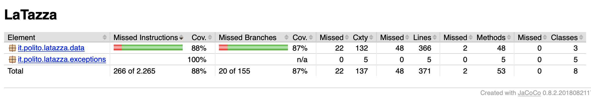

# Unit Testing Documentation template

Authors: Domenico Cefalo,Davide Miro

Date: 19/05/2019

Version: 3.0.0

# Contents

- [Black Box Unit Tests](#black-box-unit-tests)

- [White Box Unit Tests](#white-box-unit-tests)

# Black Box Unit Tests

    <Define here criteria, predicates and the combination of predicates for each function of each class.
    Define test cases to cover all equivalence classes and boundary conditions.
    In the table, report the description of the black box test case and the correspondence with the JUnit black box test case name/number>

 ### **Class *DataImpl* - method *sellCapsules***

**Criteria for method *sellCapsules*:**
	

 - Colleague existence
 - CapsuleType existence
 - CapsuleType availability
 - Usage of account
 - Capsule sign
 

**Predicates for method *sellCapsule*:**

| Criteria | Predicate |
| -------- | --------- |
| Colleague existence         | true           |
|          | false           |
| CapsuleType existence         | true          |
|          | false          |
| CapsuleType availability | numberOfCapsuleAvailable >= numberOfCapsules |
|                          | numberOfCapsuleAvailable < numberOfCapsules  |
| Usage of account | fromAccount = true |
|                  | fromAccount = false |
|Capsule sign| >0|
|| < 0| 

**Boundaries**:

| Criteria | Boundary values |
| -------- | --------------- |
|    CapsuleType availability      | numberOfCapsuleAvailable = numberOfCapsules                 |
| Capsule sign | = 0 |

**Combination of predicates**:

| Colleague existence | Capsule existence | CapsuleType availability | Usage of account |Capsule sign|Valid / Invalid | Description of the test case | JUnit test case |
|-------|-------|-------|-------|-------|-------|-------|------|
| T | T | numberOfCapsuleAvailable >= numberOfCapsules | T | > 0|V | employeeId = 0,beverageId=0,numberOfCapsule=50(caspuleAvailability for type "caffé" = 100) | it.polito.latazza.data.TestDataImpl.testSellWithAccount|
|T|T|numberOfCapsuleAvailable >= numberOfCapsules|F|>0|V| previousEmployeeBalance == nextEmployeeBalance | it.polito.latazza.data.TestDataImpl.testSellWithAccountFalse |
|T|T|numberOfCapsuleAvailable < numberOfCapsule| T |>0|I| numberoOfCapsuleAvailable for type selected = 1,numberoOfCapsule = 2,NotEnoughCapsule|it.polito.latazza.data.TestDataImpl.testSellWithAccountNotCapsules|
|T|T|numberOfCapsuleAvailable < numberOfCapsule|F|>0|I| numberoOfCapsuleAvailable for type selected = 1,numberoOfCapsule = 2,NotEnoughCapsule|it.polito.latazza.data.TestDataImpl.testSellWithAccountFalseNotCapsules|
| T | T | \ |T | <0 | I | numberOfCapsule = 10 ->BeverageException | it.polito.latazza.data.TestDataImpl.testSellWithAccountNegativeCapsules|
| T | T | \ | F | <0 | I || |
|T|F|numberOfCapsuleAvailable >= numberOfCapsules|T|>0|I|capsuleId = 1000,BeverageException| it.polito.latazza.data.TestDataImpl.testSellWithAccountNotBeverage|
|T|F|numberOfCapsuleAvailable >= numberOfCapsules|F|>0|I|  |  |
|T|F|numberOfCapsuleAvailable < numberOfCapsule| T |>0|I| ||
|T|F|numberOfCapsuleAvailable < numberOfCapsule|F|>0|I|||
| T | F | \ |T | <0 | I |  | |
| T | F | \ | F | <0 | I || |
|F|T|numberOfCapsuleAvailable >= numberOfCapsules|T|>0|I|colleagueId=1000,EmployeeException| it.polito.latazza.data.TestDataImpl.testSellWithAccountNotEmployee|
|F|T|numberOfCapsuleAvailable >= numberOfCapsules|F|>0|I|  |  |
|F|T|numberOfCapsuleAvailable < numberOfCapsule| T |>0|I| ||
|F|T|numberOfCapsuleAvailable < numberOfCapsule|F|>0|I|||
| F | T | \ |T | <0 | I |  | |
| F | T | \ | F | <0 | I || |
|F|F|numberOfCapsuleAvailable >= numberOfCapsules|T|>0|I|||
|F|F|numberOfCapsuleAvailable >= numberOfCapsules|F|>0|I|  |  |
|F|F|numberOfCapsuleAvailable < numberOfCapsule| T |>0|I| ||
|F|F|numberOfCapsuleAvailable < numberOfCapsule|F|>0|I|||
| F | F | \ |T | <0 | I |  | |
| F | F | \ | F | <0 | I || |

**Criteria for method *sellCapsuleToVisitors*:**
	

 - CapsuleType existence
 - CapsuleType availability
 - Capsule sign

**Predicates for method *sellCapsuleToVisitors*:**

| Criteria | Predicate |
| -------- | --------- |
| CapsuleType existence         | true          |
|          | false          |
| CapsuleType availability | numberOfCapsuleAvailable >= numberOfCapsules |
|                          | numberOfCapsuleAvailable < numberOfCapsules  |
| Capsule sign | >0 |
|   | <0 |

**Boundaries**:

| Criteria | Boundary values |
| -------- | --------------- |
|    CapsuleType availability      | numberOfCapsuleAvailable = numberOfCapsules                 |
| Capsule sign | numberOfCapsule = 0 |

**Combination of predicates**:

| Capsule existence | CapsuleType availability |Capsule sign| Valid / Invalid | Description of the test case | JUnit test case |
|-------------------|--------------------------|------------|-----------------|------------------------------|-----------------|
| T | numberOfCapsuleAvailable >= numberOfCapsules | >0|V |beverageId=0,numberOfCapsule=2(caspuleAvailability for type 10)| it.polito.latazza.data.TestDataImpl.testSellVisitor|
|T|numberOfCapsuleAvailable < numberOfCapsule|>0|I| numberoOfCapsuleAvailable for type 1 = 50,numberOfCapsule = 100,NotEnoughCapsule|it.polito.latazza.data.TestDataImpl.testSellVisitorNotCapsulesAvailable |
|T |numberOfCapsule = - 10|<0|I|BeverageException|it.polito.latazza.data.TestDataImpl.testSellVisitorNegativeCapsule|
| F | numberOfCapsuleAvailable >= numberOfCapsules | >0|I |beverageId=0,numberOfCapsule=2(caspuleAvailability for type 10)| it.polito.latazza.data.TestDataImpl.testSellVisitorNotCapsule|
|F | \ |<0|I|||

**Criteria for method *rechargeAccount*:**
	

 - Colleague existence

**Predicates for method *rechargeAccount*:**

| Criteria | Predicate |
| -------- | --------- |
| Colleague existence         | true           |
|          | false           |

**Boundaries**:

| Criteria | Boundary values |
| -------- | --------------- |

**Combination of predicates**:

| Colleague existence| Valid / Invalid | Description of the test case | JUnit test case |
|--------------------|-----------------|------------------------------|-----------------|
| T | V | colleagueId = 0, amount = 50 -> accountBalance+=amount |it.polito.latazza.data.TestDataImpl.testRechargeAccount |
| F | I | colleagueId = 1000, amount = 50 -> EmployeeException |it.polito.latazza.data.TestDataImpl.testRechargeaccountNotEmployee|

**Criteria for method *buyBoxes*:**
	

 - Beverage existence
 - Balance availability
 - Boxes sign

**Predicates for method *buyBoxes*:**

| Criteria | Predicate |
| -------- | --------- |
| Beverage existence         | true           |
|          | false           |
| Balance availability        | balance >= quantity*boxPrice          |
|          | balance < quantity*boxPrice         |
| Boxes sign | >0 |
|  | <0 |

**Boundaries**:

| Criteria | Boundary values |
| -------- | --------------- |

**Combination of predicates**:

| Beverage existence | Balance availability | Boxes sign |Valid / Invalid | Description of the test case | JUnit test case |
|--------------------|----------------------|------------|----------------|------------------------------|-----------------|
| T | balance >= quantity*boxPrice | >0 | V | beverageId = 0, quantity = 1 ,boxPrice = 100 ,balance = 1000 -> capsuleAvailability +=50, balance = 900 | it.polito.latazza.data.TestDataImpl.testBuyBoxes
| F | \ | >0 | I | beverageId = not exist, quantity = 1 ,balance = 20 -> BeverageException | it.polito.latazza.data.TestDataImpl.testBuyBoxesNotBeverage|
| T | balance < quantity*boxPrice | >0| I | beverageId = 0, quantity = 20 ,boxPrice = 100 ,balance = 1000 -> NotEnoughBalanceException | it.polito.latazza.data.TestDataImpl.testBuyBoxesNotBalance|
| T | \ | <0 | I | quantity = -20->BeverageException | it.polito.latazza.data.TestDataImpl.testBuyBoxesNegativeBoxes |

**Criteria for method *getEmployeeReport*:**
	

 - Colleague existence
 - Start date 
 - End date 
 - Dates consistency
 - Dates range
 

**Predicates for method *getEmployeeReport*:**

| Criteria | Predicate |
| -------- | --------- |
| Colleague existence         | true           |
|          | false           |
| Start date          | not null           |
|          | null           |
| End date format         | not null          |
|          | null           |
| Date consistency | startDate <= endDate
| | startDate > endDate |
| Dates range | startDate =< lastTimestamp and endDate >= firstTimestamp |
|             | startDate > lastTimestamp or endDate < firstTimestamp |

**Boundaries**:

| Criteria | Boundary values |
|-----|----|
| Data consistency | startDate == endDate  |

**Combination of predicates**:

| Colleague existence | Start date format | End date format |Date consistency | Dates range |Valid / Invalid | Description of the test case | JUnit test case |
|---------------------|-------------------|-----------------|-----------------|-------------|----------------|------------------------------|-----------------|
| T | not null | not null |true| startDate<=lastTimestamp and endDate >= firstTimestamp | V | colleagueId exist,startDate=1/1/2019,endDate=31/12/2019,-> correct list | it.polito.latazza.data.TestDataImpl.testGetEmployeeReport |
| F | not null | not null | true | startDate<=lastTimestamp and endDate >= firstTimestamp | I | colleagueId = 1000 startDate=1/1/2019,endDate=31/12/2019 -> EmployeeException | it.polito.latazza.data.TestDataImpl.testGetEmployeeReportNotEmployee |
| T | null | not null | \ | \ | I | colleagueId = exist  startDate=null,endDate=31/12/2019 -> DateException | it.polito.latazza.data.TestDataImpl.testGetEmployeeReportStartNull |
| T | not null | null |\ | \ | I | colleagueId = exist startDate=1/1/2019,endDate=null -> DateException | it.polito.latazza.data.TestDataImpl.testGetEmployeeReportEndNull |
| T | null | null |\ | \ | I | colleagueId = exist startDate=null,endDate=null -> DateException | |
| F | null | not null | \ | \ | I |  |  |
| F | not null | null |\ | \ | I |  | |
| F | null | null |\ | \ | I | | |
| T | not null | not null | false | startDate>=lastTimestamp and endDate >= firstTimestamp | I | colleagueId = exist startDate=31/12/2019,endDate=1/1/2019 -> DateException | it.polito.latazza.data.TestDataImpl.testGetEmployeeReportDateConsistence |
| T | not null | not null | true | startDate<=lastTimestamp or endDate >= firstTimestamp | V | colleagueId = exist startDate=01/01/2019,endDate=31/12/2019 -> return EmptyList | it.polito.latazza.data.TestDataImpl.testGetEmployeeReportEmptyList |
| F | not null | not null | false | startDate>=lastTimestamp and endDate >= firstTimestamp | I |  | |
| F | not null | not null | true | startDate<=lastTimestamp or endDate >= firstTimestamp | I |  | |

**Criteria for method *getReport*:**
	

 - Start date 
 - End date 
 - Dates consistency
 - Dates range
 

**Predicates for method *getReport*:**

| Criteria | Predicate |
| -------- | --------- |
| Start date          | not null           |
|          | null           |
| End date          | not null          |
|          | null           |
| Date consistency | startDate <= endDate
| | startDate > endDate |
| Dates range | startDate =< lastTimestamp and endDate >= firstTimestamp |
|             | startDate > lastTimestamp or endDate < firstTimestamp |

**Boundaries**:

| Criteria | Boundary values |
|-----|----|
| Data consistency | startDate == endDate  |

**Combination of predicates**:

| Start date format | End date format |Date consistency | Dates range |Valid / Invalid | Description of the test case | JUnit test case |
|-------------------|-----------------|-----------------|-------------|----------------|------------------------------|-----------------|
| not null | not null |true| startDate<=lastTimestamp and endDate >= firstTimestamp | V | colleagueId exist,startDate=1/1/2019,endDate=31/12/2019 -> correct list | it.polito.latazza.data.TestDataImpl.testgetReport |
| null | not null| \ | \ | I | colleagueId exist,startDate = null,endDate=31/12/2019 -> DateException | it.polito.latazza.data.TestDataImpl.testGetReportStartNull |
| not null | null| \ | \ | I | colleagueId exist,startDate = 1/1/2019,endDate=null -> DateException | it.polito.latazza.data.TestDataImpl.testGetReportEndNull |
| null | null| \ | \ | I | | |
| not null | not null| true | startDate>=lastTimestamp or endDate <= firstTimestamp | I | colleagueId exist,startDate = 1/1/2019,endDate=31/12/2019 -> EmptyList | it.polito.latazza.data.TestDataImpl.testGetReportEmptyList |
| not null | not null| false | \ | I | colleagueId exist,startDate = 31/12/2019,endDate=01/01/2019 -> DataException | it.polito.latazza.data.TestDataImpl.testGetReportDatesConsistence |

**Criteria for method *createBeverage*:**
	

 - CapsulePerBox sign
 - BoxPrice sign

 

**Predicates for method *createBeverage*:**

| Criteria | Predicate |
| -------- | --------- |
| CapsulePerBox sign | > 0 |
|                    | <= 0 |
| BoxPrice sign | > 0 |
|  | <= 0 |

**Boundaries**:

| Criteria | Boundary values |
|-----|----|

**Combination of predicates**:

| CapsulePerBoxSign| BoxPrice sign |Valid / Invalid | Description of the test case | JUnit test case |
|------------------|---------------|----------------|------------------------------|-----------------|
| >0 | >0 |  V | boxPrice = 100 capsulePerBox = 50 name ="caffé"| it.polito.latazza.data.TestDataImpl.testCreateBeverage|
| <=0 | >0 | V | boxPrice = 100 capsulePerBox =-50 ->BeverageException | it.polito.latazza.data.TestDataImpl.testCreateBeverageNegativeBox |
| >0 | <=0 | V | boxPrice -100 capsulePerBox = 50 -> BeverageException | it.polito.latazza.data.TestDataImpl.testCreateBeverageNegativePrice |
| <=0 | <=0 | I | | |

**Criteria for method *updateBeverage*:**
	

 - CapsulePerBox sign
 - BoxPrice sign
 - Id
 

 

**Predicates for method *updateBeverage*:**

| Criteria | Predicate |
| -------- | --------- |
| CapsulePerBox sign | > 0 |
|                    | <= 0 |
| BoxPrice sign | > 0 |
|  | <= 0 |
| Id | exist |
| | not exist |

**Boundaries**:

| Criteria | Boundary values |
|----------|-----------------|

**Combination of predicates**:

| CapsulePerBoxSign| BoxPrice sign | Id |Valid / Invalid | Description of the test case | JUnit test case |
|------------------|---------------|----|----------------|------------------------------|-----------------|
| >0 | >0 | exist | V | id = 0 boxPrice = 60 capsulePerBox = 30 name ="the"| it.polito.latazza.data.TestDataImpl.testUpdateBeverage |
| >0 | >0 | not exist | I | id = 1000 -> BeverageException | it.polito.latazza.data.TestDataImpl.testUpdateBeverageWrongId |
| <=0 | >0 | exist | I | boxPrice = 60 capsulePerBox =-30 ->BeverageException | it.polito.latazza.data.TestDataImpl.testUpdateBeverageNegativeBox |
| >0 | <=0 | exist | I | boxPrice = -60 capsulePerBox =30 ->BeverageException | it.polito.latazza.data.TestDataImpl.testUpdateBeverageNegativePrice |
| <=0 | <=0 | exist | I |  | |
| <=0 | >0 | not exist | I | | |
| >0 | <=0 | not exist | I | ||
| <=0 | <=0 | not exist | I |  | |

**Criteria for method *getBeverageName*:**

 - Id existence
 
**Predicates for method *getBeverageName*:**

| Criteria | Predicate |
| -------- | --------- |
| Id |  true|
|                    | false |

**Boundaries**:

| Criteria | Boundary values |
|----------|-----------------|

**Combination of predicates**:

| Id |Valid / Invalid | Description of the test case | JUnit test case |
|----|----------------|------------------------------|-----------------|
| true | V | valid id return name| tested in createBeverage|
| false | I | invalid id  -> BeverageException | it.polito.latazza.data.TestDataImpl.testGetBeverageNameInvalidId|

**Criteria for method *getBeverageCapsulesPerBox*:**

 - Id existence

**Predicates for method *getBeverageCapsulesPerBox*:**

| Criteria | Predicate |
| -------- | --------- |
| Id |  true |
|    | false |

**Boundaries**:

| Criteria | Boundary values |
|----------|-----------------|

**Combination of predicates**:

| Id |Valid / Invalid | Description of the test case | JUnit test case |
|----|----------------|------------------------------|-----------------|
| true | V | valid id return CapsulesPerBox| tested in createBeverage|
| false | I | invalid id  -> BeverageException | it.polito.latazza.data.TestDataImpl.testGetBeverageCapsulesXBox|

**Criteria for method *getBeverageBoxPrice*:**

 - Id existence
 

**Predicates for method *getBeverageBoxPrice*:**

| Criteria | Predicate |
| -------- | --------- |
| Id |  true|
|                    | false |

**Boundaries**:

| Criteria | Boundary values |
|----------|-----------------|

**Combination of predicates**:

| Id |Valid / Invalid | Description of the test case | JUnit test case |
|----|----------------|------------------------------|-----------------|
| true | V | valid id return price| tested in createBeverage|
| false | I | invalid id  -> BeverageException | it.polito.latazza.data.TestDataImpl.testGetBeverageBoxPrice|

**Criteria for method *getBeveragesId*:**

- 

 
**Predicates for method *getBeveragesId*:**

| Criteria | Predicate |
| -------- | --------- |

**Boundaries**:

| Criteria | Boundary values |
|----------|-----------------|

**Combination of predicates**:

|Valid / Invalid | Description of the test case | JUnit test case |
|----------------|------------------------------|-----------------|
|V|id =createBeverage=("caffé",50,100); id1=createBeverage("the",30,60)getBeveragesId() -> [id,id1]|it.polito.latazza.data.TestDataImpl.testGetBeveragesId|

**Criteria for method *getBeverages*:**

 - Id

**Predicates for method *getBeverages*:**

| Criteria | Predicate |
| -------- | --------- |

**Boundaries**:

| Criteria | Boundary values |
|----------|-----------------|

**Combination of predicates**:

| Id| Valid / Invalid | Description of the test case | JUnit test case |
|---|-----------------|------------------------------|-----------------|
|true|V|beverageName1="caffè" id; id1beverageName2="thè" id=id2 --> return Map<Integer,String>{(id,caffè);(id1,"thè")}|it.polito.latazza.data.TestDataImpl.testGetBeverages|

**Criteria for method *getBeverageCapsules*:**
 
 - Id

**Predicates for method *getBeverageCapsules*:**

| Criteria | Predicate |
| -------- | --------- |
| Id | true |
|    | false |

**Boundaries**:

| Criteria | Boundary values |
|----------|-----------------|

**Combination of predicates**:

|id| Valid / Invalid | Description of the test case | JUnit test case |
|--|-----------------|------------------------------|-----------------|
|true|V|if id exist --> return getQuantityAvailable| tested in testSellWithAccount |
|false|I|Id not exist --> BeverageException | it.polito.latazza.data.TestDataImpl.testGetBeverageCapsulesNotExist |

**Criteria for method *createEmployee*:**

**Predicates for method *createEmployee*:**

| Criteria | Predicate |
| -------- | --------- |

**Boundaries**:

| Criteria | Boundary values |
|----------|-----------------|

**Combination of predicates**:

| Valid / Invalid | Description of the test case | JUnit test case |
|-----------------|------------------------------|-----------------|
| V | createEmployee("Name1","Surname1") | tested in sellCapsuleWithAccount|

**Criteria for method *updateEmployee*:**
 

 - Id 

**Predicates for method *updateEmployee*:**

| Criteria | Predicate |
| -------- | --------- |
|Id|exist|
||not exist|

**Boundaries**:

| Criteria | Boundary values |
|----------|-----------------|

**Combination of predicates**:

| Id | Valid / Invalid | Description of the test case | JUnit test case |
|----|-----------------|------------------------------|-----------------|
|exist|V| Name="Davide" and Surname="Miro" --> NewName="Domenico" and NewSurname="Cefalo" | it.polito.latazza.data.TestDataImpl.testUpdateEmployee|
|not exist|I|Id not in DB --> EmployeeException| it.polito.latazza.data.TestDataImpl.testUpdateEmployeeNotExist|

**Criteria for method *getEmployeeName*:**
 
 - Id 

**Predicates for method *getEmployeeName*:**

| Criteria | Predicate |
| -------- | --------- |
|Id| exist|
| |not exist|

**Boundaries**:

| Criteria | Boundary values |
|----------|-----------------|

**Combination of predicates**:

| Id | Valid / Invalid | Description of the test case | JUnit test case |
|----|-----------------|------------------------------|-----------------|
|exist|V| Id exist --> return Name | tested in testUpdateEmployee|
|not exist|I|Id not exist --> EmployeeException| it.polito.latazza.data.TestDataImpl.testGetEmployeeNameNotId|

**Criteria for method *getEmployeeSurname*:**
 
 - Id 

**Predicates for method *getEmployeeSurname*:**

| Criteria | Predicate |
| -------- | --------- |
|Id| exist|
| |not exist|

**Boundaries**:

| Criteria | Boundary values |
|----------|-----------------|

**Combination of predicates**:

| Id | Valid / Invalid | Description of the test case | JUnit test case |
|----|-----------------|------------------------------|-----------------|
|exist|V| Id exist --> return surname | tested in testUpdateEmployee|
|not exist|I|Id not exist --> EmployeeException| it.polito.latazza.data.TestDataImpl.testGetEmployeeSurnameNotId|

**Criteria for method *getEmployeeBalance*:**
 
 - Id 

**Predicates for method *getEmployeeBalance*:**

| Criteria | Predicate |
| -------- | --------- |
|Id|exist|
| |not exist|

**Boundaries**:

| Criteria | Boundary values |
|----------|-----------------|

**Combination of predicates**:

| Id | Valid / Invalid | Description of the test case | JUnit test case |
|----|-----------------|------------------------------|-----------------|
|exist|V| Id exist --> return balance | tested in testSellWithAccount|
|not exist|I|Id not exist --> EmployeeException| it.polito.latazza.data.TestDataImpl.testGetEmployeeBalanceNotId|

# White Box Unit Tests

### Test cases definition

    <Report here all the created JUnit test cases, and the units/classes they test >

| Unit name | JUnit test case |
|-----------|-----------------|
|DataImpl|it.polito.latazza.data.TestDataImpl.testSellWithAccount|
||it.polito.latazza.data.TestDataImpl.testSellWithAccountFalse|
||it.polito.latazza.data.TestDataImpl.testSellWithAccountNotCapsules|
||it.polito.latazza.data.TestDataImpl.testSellWithAccountFalseNotCapsules|
||it.polito.latazza.data.TestDataImpl.testSellWithAccountNotEmployee|
||it.polito.latazza.data.TestDataImpl.testSellWithAccountNotBeverage|
||it.polito.latazza.data.TestDataImpl.testSellVisitor|
||it.polito.latazza.data.TestDataImpl.testSellVisitorNotCapsuleAvailable|
||it.polito.latazza.data.TestDataImpl.testSellVisitorNotBeverage|
||it.polito.latazza.data.TestDataImpl.testRechrgeAccount|
||it.polito.latazza.data.TestDataImpl.testRechargeAccountNotEmployee|
||it.polito.latazza.data.TestDataImpl.testBuyBoxes|
||it.polito.latazza.data.TestDataImpl.testBuyBoxesNotBeverage|
||it.polito.latazza.data.TestDataImpl.testBuyBoxesNotBalance|
||it.polito.latazza.data.TestDataImpl.testBuyBoxesNegativeBoxes|
||it.polito.latazza.data.TestDataImpl.testCreateBeverage|
||it.polito.latazza.data.TestDataImpl.testCreateBeverageNegativeBox|
||it.polito.latazza.data.TestDataImpl.testCreateBeverageNegativePrice|
||it.polito.latazza.data.TestDataImpl.testUpdateBeverage|
||it.polito.latazza.data.TestDataImpl.testUpdateBeverageWrongId|
||it.polito.latazza.data.TestDataImpl.testUpdateBeverageNegativeCapsules|
||it.polito.latazza.data.TestDataImpl.testUpdateBeverageNegativeBox|
||it.polito.latazza.data.TestDataImpl.testGetBeverageNameInvalidId|
||it.polito.latazza.data.TestDataImpl.testGetBeverageCapsulesXBox|
||it.polito.latazza.data.TestDataImpl.testGetBeverageBoxPrice|
||it.polito.latazza.data.TestDataImpl.testGetBeveragesId|
||it.polito.latazza.data.TestDataImpl.testGetBeverages|
||it.polito.latazza.data.TestDataImpl.testGetBeverageCapsulesNotExist|
||it.polito.latazza.data.TestDataImpl.testUpdateEmployee|
||it.polito.latazza.data.TestDataImpl.testUpdateEmployeeNotExist|
||it.polito.latazza.data.TestDataImpl.testGwtEmployeeReport|
||it.polito.latazza.data.TestDataImpl.testGetEmployeeReportNotEmployee|
||it.polito.latazza.data.TestDataImpl.testGetEmployeeReportStartNull|
||it.polito.latazza.data.TestDataImpl.testGetEmployeeReportEndNull|
||it.polito.latazza.data.TestDataImpl.testGetEmployeeReportDatesConsistence|
||it.polito.latazza.data.TestDataImpl.testGetEmployeeReportEmptyList|
||it.polito.latazza.data.TestDataImpl.testGetReport|
||it.polito.latazza.data.TestDataImpl.testGetReportStartNull|
||it.polito.latazza.data.TestDataImpl.testGetReportEndNull|
||it.polito.latazza.data.TestDataImpl.testGetReportDatesConsistence|
||it.polito.latazza.data.TestDataImpl.testGetReportEmptyList|
||it.polito.latazza.data.TestDataImpl.testGetEmployeeNameNotId|
||it.polito.latazza.data.TestDataImpl.testGetEmployeeBalanceNotId|
||it.polito.latazza.data.TestDataImpl.testGetEmployeeId|
||it.polito.latazza.data.TestDataImpl.testGetEmployees|
||it.polito.latazza.data.TestDataImpl.testReadFilesZeroTime|
||it.polito.latazza.data.TestDataImpl.testReadFilesMultipleTimes|
||it.polito.latazza.data.TestDataImpl.testReadFilesMultipleTimes|
||it.polito.latazza.data.TestDataImpl.testChangeSellWithAccountWhiteBox|
||it.polito.latazza.data.TestDataImpl.testChangeSellWithNoAccountWhiteBox|
||it.polito.latazza.data.TestDataImpl.testChangeSelltoVisitorWhiteBox|

### Code coverage report

    <Add here the screenshot report of the code and branch coverage obtained using
    the Jacoco tool. >
    

    

### Loop coverage analysis

    <Identify significant loops in the units and reports the test cases
    developed to cover zero, one or multiple iterations >

|Unit name | Loop rows | Number of iterations | JUnit test case |
|----------|-----------|----------------------|-----------------|
| DataImpl | 43-64 | 0| it.polito.latazza.data.TestDataImpl.testReadFilesZeroTimes|
| DataImpl | 43-64 | 1| it.polito.latazza.data.TestDataImpl.testReadFilesOneTime|
| DataImpl | 43-64 | 4| it.polito.latazza.data.TestDataImpl.testReadFilesMultipleTimes|
| DataImpl | 81-105 | 0| it.polito.latazza.data.TestDataImpl.testReadFilesZeroTimes|
| DataImpl | 81-105 | 1| it.polito.latazza.data.TestDataImpl.testReadFilesOneTime|
| DataImpl | 81-105 | 5| it.polito.latazza.data.TestDataImpl.testReadFilesMultipleTimes|
