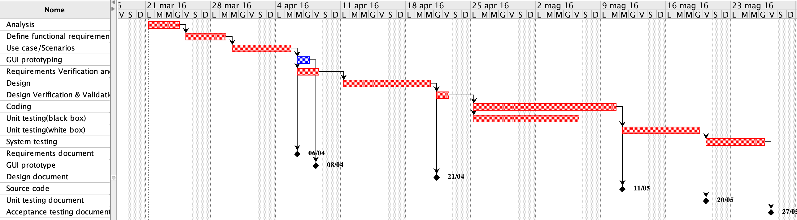

# Project Estimation  template

Authors: Domenico Cefalo (s267569), Filomeno Davide Miro (s256870)

Date: 02/06/2019

Version: 1.0.9

# Contents

- [[Data from your LaTazza project]

- [Estimate by product decomposition]
- [Estimate by activity decomposition ]

# Data from your LaTazza project

###
|||
| ----------- | ------------------------------- | 
|Total Java LoC delivered on April 26 (only code, no Junit code) | 626|
| Total number of Java classes delivered on April 26 (only code, no Junit code)| 3|
| Productivity P =| 12 [LOC/ph] |
|Average size of Java class A = | 208 |

# Estimate by product decomposition

###               

|             | Estimate                        |             
| ----------- | ------------------------------- |  
| Estimated n classes   |   6 |             
| Estimated LOC per class  (Here use Average A computed above ) |  208 |  
| Estimated LOC (=NC*A)| 1248|
| Estimated effort  (person days) (Here use productivity P)  | 13 person days |
| Estimated calendar time (calendar weeks) (Assume team of 4 people, 8 hours per day, 5 days per week ) |  0,65 |        

# Estimate by activity decomposition

### 

|         Activity name    | Estimated effort    |             
| ----------- | ------------------------------- | 
| Analysis (Context diagram,stories,ecc) | 4 days |
| Define functional/Non functional requirements | 3 days |
| Use Case/Scenarios | 5 days |
| GUI prototyping | 2 days |
| Requirements Verification & Validation | 2 days |
| Design | 8 days |
| Design Verification & Validation | 2 days |
| Coding | 12 days |
| Unit testing(black box) | 10 days |
| Unit testing(White box) | 7 days |
| System testing | 5 days |

###
Insert here Gantt chart with above activities

